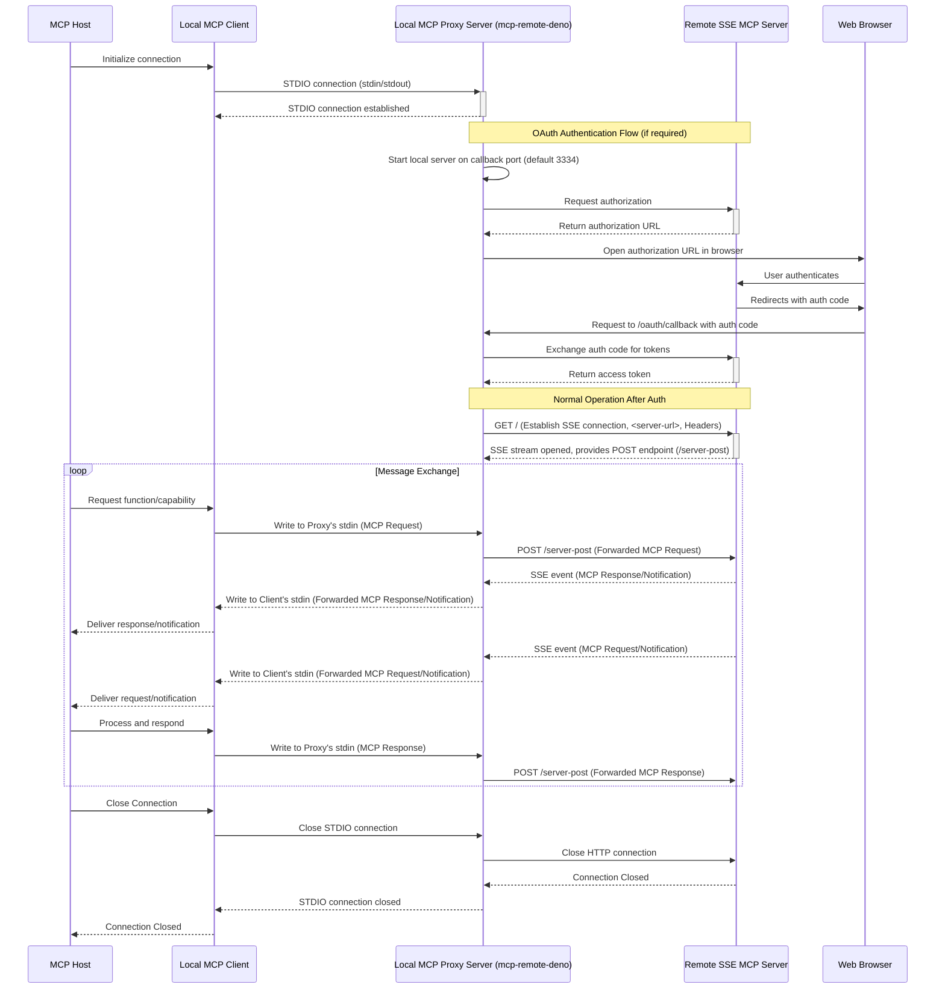

# mcp-remote-deno

A Deno wrapper for the [mcp-use](https://github.com/geelen/mcp-remote) proxy server that connects to remote MCP (Model Context Protocol) servers.

## Features

- Runs natively in Deno, utilizing NPM compatibility
- Provides a clean CLI interface
- Supports custom HTTP headers
- TypeScript type definitions included
- Handles OAuth authentication with remote MCP servers

## Prerequisites

- [Deno](https://deno.com/) 1.37.0 or higher

## Installation

No installation is needed if you have Deno installed. You can run the proxy directly.

## Usage

The primary way to use this tool is via the command line to start the proxy server.

### Running with `deno task` (Recommended)

If you have cloned the repository, you can use the predefined Deno task:

```bash
# Basic usage: Connects to the server and listens on default port 3334 for OAuth redirects
deno task proxy:start <server-url>

# Example:
deno task proxy:start https://remote.mcp.server.example.com

# Specify a custom local port for OAuth redirects:
deno task proxy:start <server-url> [callback-port]

# Example with custom port 8080:
deno task proxy:start <server-url> 8080

# Include custom HTTP headers for the connection to the remote server:
deno task proxy:start <server-url> [callback-port] --header "Header-Name: Header-Value" --header "Another: Value"

# Example with headers:
deno task proxy:start https://remote.mcp.server.example.com 3334 --header "Authorization: Bearer mytoken" --header "X-Custom-ID: 12345"
```

**Arguments:**

- `<server-url>`: (Required) The URL of the remote MCP server you want to connect to.
- `[callback-port]`: (Optional) The local port the proxy should listen on for OAuth redirects from the remote MCP server. Defaults to `3334`. Note that if the specified port is unavailable, an open port will be chosen at random.
- `--header "Name: Value"`: (Optional, repeatable) Custom HTTP headers to send to the remote MCP server during the initial connection.

### Running with `deno run`

You can also run the proxy script directly using `deno run`. This requires specifying the necessary permissions precisely.

```bash
# Define permissions based on deno.json task
DENO_PERMISSIONS="--allow-env --allow-read --allow-sys=homedir --allow-run=open --allow-write=\"$HOME/.mcp-auth/mcp-remote-deno-0.0.1\" --allow-net=0.0.0.0,127.0.0.1,localhost"

# Basic usage with specific permissions:
deno run $DENO_PERMISSIONS src/proxy.ts <server-url> [callback-port]

# Example:
deno run $DENO_PERMISSIONS src/proxy.ts https://remote.mcp.server.example.com

# Example with custom port and headers:
deno run $DENO_PERMISSIONS src/proxy.ts https://remote.mcp.server.example.com 8080 --header "Authorization: Bearer mytoken"
```

*Note: Using `deno task proxy:start` is simpler as it automatically applies the correct permissions defined in `deno.json`.*

## API

You can also use the library programmatically in your Deno projects:

```typescript
import { startProxy, runProxy } from "jsr:@mmizutani/mcp-remote-deno@^100.1";

// Using the wrapped function
await startProxy("https://remote.mcp.server.example.com", 3334, {
  "Authorization": "Bearer token"
});

// Or using the direct import from mcp-use
await runProxy("https://remote.mcp.server.example.com", 3334, {
  "Authorization": "Bearer token"
});
```

## Development

```bash
# Run in development mode with auto-reload
deno task dev https://remote.mcp.server.example.com

# Check types
deno check mod.ts cli.ts

# Format code
deno fmt
```

## How It Works

This project uses Deno's NPM compatibility feature to directly import and use the `mcp-use` NPM package without the need for running Node.js in a subprocess or container. It wraps the functionality in a Deno-friendly API with TypeScript type definitions.

### Bidirectional Proxying Explained

The core functionality relies on establishing communication channels based on two different MCP transport specifications across three components:

1. **MCP Host (Cursor) <-> Local MCP Client:**
    - The MCP Host (such as Cursor IDE) contains an embedded MCP Client that communicates with MCP Servers.
    - The Host application provides the user interface and LLM integration capabilities.

2. **Local MCP Client <-> Local MCP Proxy Server:**
    - The proxy uses STDIO transport (stdin/stdout) for communication with the local MCP client.
    - The local MCP client sends messages to the proxy via stdout, which the proxy reads from stdin.
    - The proxy sends messages to the local client via stdout, which the client reads from stdin.
    - This follows the MCP STDIO transport specification where messages are delimited by newlines.

3. **Local MCP Proxy Server <-> Remote SSE MCP Server:**
    - The proxy makes an initial HTTP connection to the remote SSE MCP server specified by the `<server-url>` argument to establish an SSE connection. Any custom headers provided via the `--header` flag are sent during this setup.
    - The proxy receives messages *from* the remote server via this SSE connection.
    - The proxy sends messages *to* the remote server via HTTP POST requests to the endpoint provided by the server during the initial handshake.

Once all connections are established, the proxy relays messages across the entire chain:

- The **MCP Host** initiates requests through the **Local MCP Client**.
- Messages received via stdin from the **Local MCP Client** are forwarded as HTTP POST messages to the **Remote SSE MCP Server**.
- SSE messages received from the **Remote SSE MCP Server** are forwarded via stdout to the **Local MCP Client**.
- The **Local MCP Client** delivers responses back to the **MCP Host**.

This creates a transparent bridge, allowing your MCP Host (such as Cursor) to communicate with the remote SSE MCP server, effectively translating between the STDIO and HTTP+SSE transport mechanisms defined in the MCP specification.

The proxy also handles OAuth authentication with the remote MCP server, by listening for redirects at the callback port (default 3334) on the `/oauth/callback` path.



If either the client or the server disconnects, the proxy ensures the other connection is also terminated gracefully.

## MCP Server Configuration

You can configure your local MCP client (such as Cursor IDE) to use this proxy by adding an entry to your MCP configuration file.

For Cursor, edit `~/.cursor/mcp.json` (or create it if it doesn't exist) and add the following configuration:

```json
{
  "mcpServers": {
    "${mcpServerName}": {
      "type": "stdio",
      "command": "deno",
      "args": [
        "run",
        "--allow-env",
        "--allow-read",
        "--allow-sys=homedir",
        "--allow-run=open",
        "--allow-write=\"$HOME/.mcp-auth\"",
        "--allow-net=0.0.0.0,127.0.0.1,localhost,remote.mcp.server.example.com",
        "jsr:@mmizutani/mcp-remote-deno",
        "https://remote.mcp.server.example.com/sse"
      ]
    }
  }
}
```

Replace `${mcpServerName}` with a unique name for your remote MCP server, and update the URL in the last argument to point to your actual remote MCP server endpoint.

## License

MIT - See the [LICENSE](LICENSE) file for details.

## Acknowledgements

This project would not be possible without these excellent open source projects:

- [mcp-remote](https://www.npmjs.com/package/mcp-remote) - The original NPM package that this Deno wrapper is based on. Created by Glen Maddern (@geelen), mcp-remote pioneered the approach of connecting local stdio-based MCP clients (like Cursor, Claude Desktop, and Windsurf) to remote MCP servers over HTTP+SSE. It handles the complex OAuth authentication flow and bidirectional proxying between different transport protocols, forming the foundational architecture that this Deno implementation builds upon.

- [@yamanoku/baseline-mcp-server](https://jsr.io/@yamanoku/baseline-mcp-server) - Developed by Okuto Oyama (@yamanoku), this project provided inspiration for implementing an MCP server within Deno's secure runtime environment. Its clean architecture and approach to permission management exemplifies how to properly leverage Deno's sandbox security model while maintaining full compatibility with the MCP specification.
