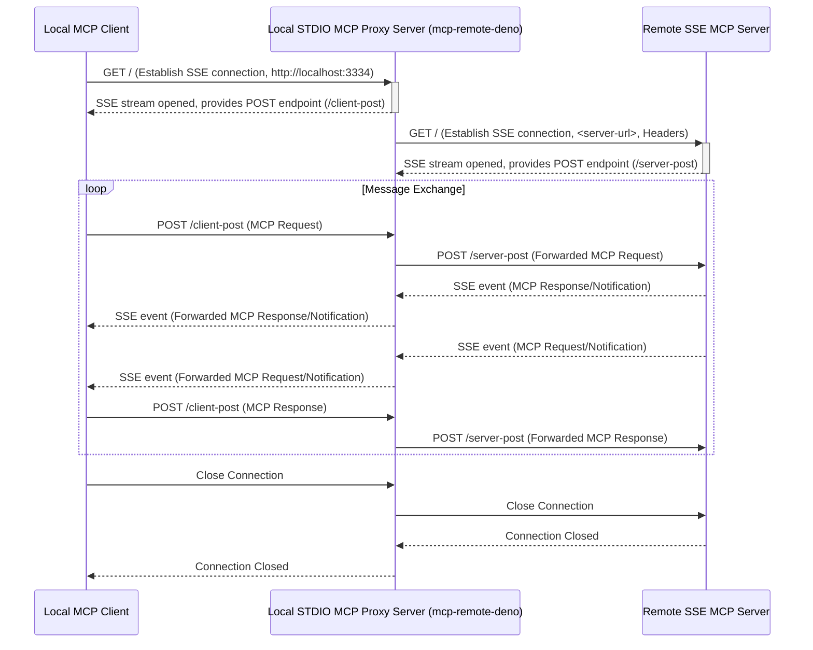

# mcp-remote-deno

A Deno wrapper for the [mcp-use](https://github.com/geelen/mcp-remote) proxy server that connects to remote MCP (Model Context Protocol) servers.

## Features

- Runs natively in Deno, utilizing NPM compatibility
- Provides a clean CLI interface
- Supports custom HTTP headers
- TypeScript type definitions included

## Prerequisites

- [Deno](https://deno.com/) 1.37.0 or higher

## Installation

No installation is needed if you have Deno installed. You can run the proxy directly.

## Usage

The primary way to use this tool is via the command line to start the proxy server.

### Running with `deno task` (Recommended)

If you have cloned the repository, you can use the predefined Deno task:

```bash
# Basic usage: Connects to the server and listens on default port 3334
deno task proxy:start <server-url>

# Example:
deno task proxy:start https://your-remote-mcp-server.com

# Specify a custom local callback port:
deno task proxy:start <server-url> [callback-port]

# Example with custom port 8080:
deno task proxy:start <server-url> 8080

# Include custom HTTP headers for the connection to the remote server:
deno task proxy:start <server-url> [callback-port] --header "Header-Name: Header-Value" --header "Another: Value"

# Example with headers:
deno task proxy:start https://your-remote-mcp-server.com 3334 --header "Authorization: Bearer mytoken" --header "X-Custom-ID: 12345"
```

**Arguments:**

- `<server-url>`: (Required) The URL of the remote MCP server you want to connect to.
- `[callback-port]`: (Optional) The local port the proxy should listen on for connections from your MCP client. Defaults to `3334`.
- `--header "Name: Value"`: (Optional, repeatable) Custom HTTP headers to send to the remote MCP server during the initial connection.

### Running with `deno run`

You can also run the proxy script directly using `deno run`. This requires specifying the necessary permissions precisely.

```bash
# Define permissions based on deno.json task
DENO_PERMISSIONS="--allow-env --allow-read --allow-sys=homedir --allow-run=open --allow-write=\"$HOME/.mcp-auth/mcp-remote-deno-0.0.1\" --allow-net=0.0.0.0,127.0.0.1,localhost"

# Basic usage with specific permissions:
deno run $DENO_PERMISSIONS src/proxy.ts <server-url> [callback-port]

# Example:
deno run $DENO_PERMISSIONS src/proxy.ts https://your-mcp-server.com

# Example with custom port and headers:
deno run $DENO_PERMISSIONS src/proxy.ts https://your-mcp-server.com 8080 --header "Authorization: Bearer mytoken"
```

*Note: Using `deno task proxy:start` is simpler as it automatically applies the correct permissions defined in `deno.json`.*

## API

You can also use the library programmatically in your Deno projects:

```typescript
import { startProxy, runProxy } from "jsr:@mmizutani/mcp-remote-deno@^100.1";

// Using the wrapped function
await startProxy("https://your-mcp-server.com", 3334, {
  "Authorization": "Bearer token"
});

// Or using the direct import from mcp-use
await runProxy("https://your-mcp-server.com", 3334, {
  "Authorization": "Bearer token"
});
```

## Development

```bash
# Run in development mode with auto-reload
deno task dev https://your-mcp-server.com

# Check types
deno check mod.ts cli.ts

# Format code
deno fmt
```

## How It Works

This project uses Deno's NPM compatibility feature to directly import and use the `mcp-use` package without the need for Node.js or a subprocess. It wraps the functionality in a Deno-friendly API with TypeScript type definitions.

### Bidirectional Proxying Explained

The core functionality relies on establishing two sets of communication channels based on the MCP HTTP+SSE transport specification:

1. **Local MCP Client <-> Local STDIO MCP Proxy Server:**
    - The STDIO MCP proxy starts an HTTP server locally (defaulting to port 3334, configurable via the `[callback-port]` argument).
    - Your local MCP client connects to this server's SSE endpoint to receive messages *from* the proxy.
    - The client sends messages *to* the proxy via HTTP POST requests to a specific endpoint provided by the proxy upon connection.
2. **Local STDIO MCP Proxy Server <-> Remote SSE MCP Server:**
    - The proxy makes an initial HTTP connection to the remote SSE MCP server specified by the `<server-url>` argument to establish an SSE connection. Any custom headers provided via the `--header` flag are sent during this setup.
    - The proxy receives messages *from* the remote server via this SSE connection.
    - The proxy sends messages *to* the remote server via HTTP POST requests to the endpoint provided by the server during the initial handshake.

Once both connections are established, the proxy relays messages between them:

- HTTP POST messages received from the **Local MCP Client** are forwarded as HTTP POST messages to the **Remote SSE MCP Server**.
- SSE messages received from the **Remote SSE MCP Server** are forwarded as SSE messages to the **Local MCP Client**.

This creates a transparent bridge, allowing your local MCP client to communicate with the remote SSE MCP server using the standard MCP HTTP+SSE transport.



If either the client or the server disconnects, the proxy ensures the other connection is also terminated gracefully.

## License

MIT - See the [LICENSE](LICENSE) file for details.
